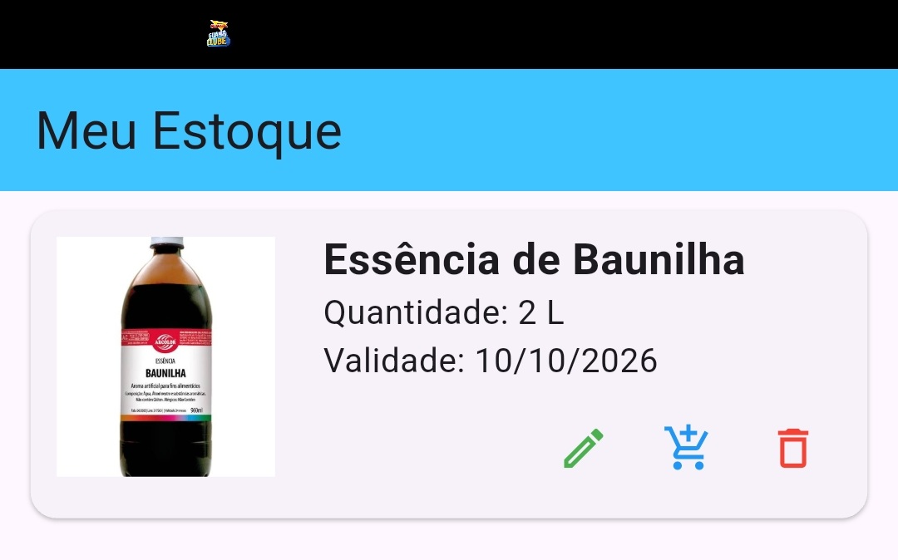

# 📦 estoque_novo 

Aplicativo de **controle de estoque** em desenvolvimento, feito em **Flutter**. O objetivo é criar uma solução multiplataforma (Android, iOS e Web) para gerenciar produtos e estoque de forma eficiente.  

---

## 🚧 Status do projeto

O projeto **ainda está em andamento**. Muitas funcionalidades já foram estruturadas, e outras estão sendo implementadas. Mudanças frequentes na arquitetura e funcionalidades são esperadas.  

---

## 🛠️ Tecnologias e conceitos utilizados

- **Flutter**: Framework para desenvolvimento de apps nativos multiplataforma.  
- **Dart**: Linguagem de programação utilizada pelo Flutter.  
- **GetX**: Gerenciamento de estado, rotas e dependências de forma reativa e simples.  
- **MVVM (Model-View-ViewModel)**: Padrão arquitetural adotado para separar responsabilidades e manter código organizado.  
- **Clean Architecture**: Estruturação do projeto em camadas (`domain`, `data`, `presentation`) para maior manutenção e escalabilidade.  
- **Injeção de Dependências**: Para desacoplamento entre camadas e fácil troca de implementações (usando GetX ou soluções manuais).  
- **Firebase** (opcional/futuro): Para autenticação, Firestore e armazenamento de dados na nuvem.  

---

## 📦 Funcionalidades previstas

- Cadastro e edição de produtos  
- Controle de quantidade e validade de produtos  
- Filtros por categoria  
- Visualização de lista de produtos em cards dinâmicos  
- Notificações de estoque baixo (futuro)  
- Interface responsiva e amigável  

---

🖼️ Visualização do App
### Exemplo do Card de Produto




## 🏗️ Estrutura do projeto

```text
lib/
 ├── core/          # Utilitários, constantes e helpers
 ├── data/          # Repositórios e acesso a dados
 ├── domain/        # Entidades, use cases, interfaces de repositório
 └── presentation/  # Páginas, widgets e ViewModels/Controllers


Arquitetura baseada em MVVM + Clean Architecture para maior organização e escalabilidade do código. ```


📄 Licença
MIT License. Veja o arquivo LICENSE para mais detalhes.

🔧 Este projeto está em desenvolvimento contínuo. Contribuições, sugestões e feedbacks são bem-vindos!

